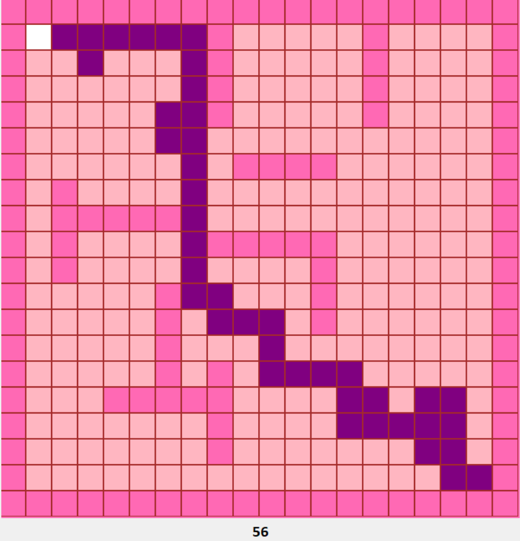

# Genetic Algorithm on Labyrinth Solving
This is my Artificial Intelligence course homework for Genetic Algorithm. I made simple labyrinth with Python Tkintker.  I found the path with the Genetic Algorithm.

![Example solution for a labyrinth.].

